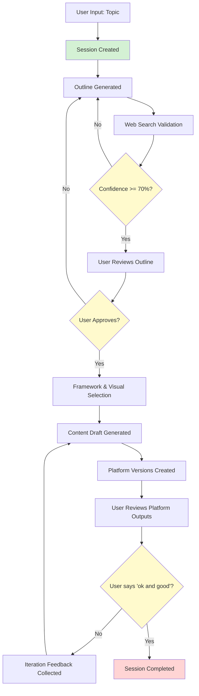
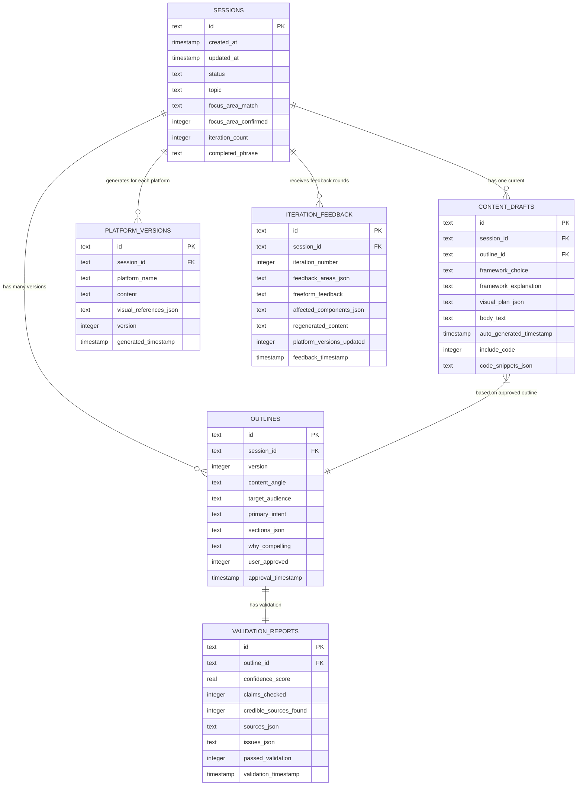

# Data Model: Personal AI Content Studio (LOCAL LAPTOP EDITION)

**Feature**: Personal AI Content Studio MVP  
**Phase**: 1 (Design)  
**Date**: 2026-02-07  
**Storage**: SQLite (local file database)

---

## Storage Architecture: SQLite (Local File)

### Design Pattern

**SQLite** (local, embedded, file-based database):
- **Location**: `~/.content-studio/sessions.db`
- **Zero configuration**: No server setup needed
- **ACID transactions**: Full relational support
- **Portable**: Single `.db` file; easy to backup manually
- **Session limit**: Max 10 sessions; auto-delete older entries
- **Sufficient for MVP**: Personal single-user, local laptop use

**Why SQLite for Local Laptop?**
- No external dependencies (no PostgreSQL server to install)
- No cloud costs (no Cosmos DB charges)
- Fast queries for personal use (typical session: < 100ms)
- Cross-platform (Mac/Windows compatible)
- Manual backup via OneDrive/iCloud/Dropbox (copy `.db` file)

**Alternative rejected**: Cosmos DB + PostgreSQL (overkill for local personal use; adds cloud costs and complexity)

---

## SQLite Schema

### Core Tables

#### 1. `sessions` Table

**Purpose**: Represents a single user content creation workflow from topic intake to platform outputs.

```sql
CREATE TABLE sessions (
    id TEXT PRIMARY KEY,                    -- UUID
    created_at TIMESTAMP NOT NULL,          -- Session start time
    updated_at TIMESTAMP NOT NULL,          -- Last update time
    status TEXT NOT NULL,                   -- Enum: input | outline_review | framework_selection | generating_content | platform_review | iterating | completed
    topic TEXT NOT NULL,                    -- Original topic input (max 500 chars)
    focus_area_match TEXT NOT NULL,         -- JSON array of matched focus areas (e.g., '["AI", "Cloud"]' or '["OUT_OF_SCOPE"]')
    focus_area_confirmed INTEGER NOT NULL,  -- Boolean: 1 = user confirmed out-of-scope topic, 0 = not confirmed
    iteration_count INTEGER NOT NULL DEFAULT 0,  -- Number of refinement cycles
    completed_phrase TEXT,                  -- "ok and good" when session ends
    CONSTRAINT chk_status CHECK (status IN ('input', 'outline_review', 'framework_selection', 'generating_content', 'platform_review', 'iterating', 'completed'))
);

CREATE INDEX idx_sessions_created_at ON sessions(created_at DESC);  -- For auto-cleanup of old sessions
CREATE INDEX idx_sessions_status ON sessions(status);
```

**Session Lifecycle**:
```
input → outline_review → (approval gate) → framework_selection → 
generating_content → platform_review → iterating → completed
```

**Session Limit Logic** (Max 10 Sessions):
```sql
-- On app startup or new session creation, run cleanup:
DELETE FROM sessions
WHERE id NOT IN (
    SELECT id FROM sessions
    ORDER BY created_at DESC
    LIMIT 10
);
```

---

#### 2. `outlines` Table

**Purpose**: Structured content plan with content angle, sections, and validation results.

```sql
CREATE TABLE outlines (
    id TEXT PRIMARY KEY,                    -- UUID
    session_id TEXT NOT NULL,               -- Foreign key to sessions
    version INTEGER NOT NULL,               -- Outline version (1, 2, 3...) for regenerations
    content_angle TEXT NOT NULL,            -- Why this angle matters (max 500 chars)
    target_audience TEXT NOT NULL,          -- Primary audience (max 200 chars)
    primary_intent TEXT NOT NULL,           -- Enum: educate | inspire | guide | entertain | challenge
    sections TEXT NOT NULL,                 -- JSON array of outline sections (e.g., '["Hook", "Problem", "Solution"]')
    why_compelling TEXT NOT NULL,           -- Explanation (max 1000 chars)
    user_approved INTEGER NOT NULL,         -- Boolean: 1 = approved, 0 = pending
    approval_timestamp TIMESTAMP,           -- When user approved (null if pending)
    FOREIGN KEY (session_id) REFERENCES sessions(id) ON DELETE CASCADE,
    CONSTRAINT chk_primary_intent CHECK (primary_intent IN ('educate', 'inspire', 'guide', 'entertain', 'challenge'))
);

CREATE INDEX idx_outlines_session_id ON outlines(session_id);
CREATE INDEX idx_outlines_version ON outlines(session_id, version DESC);
```

---

#### 3. `validation_reports` Table

**Purpose**: Tracks fact-checking results from web search (Bing API) and source credibility scoring.

```sql
CREATE TABLE validation_reports (
    id TEXT PRIMARY KEY,                    -- UUID
    outline_id TEXT NOT NULL,               -- Foreign key to outlines
    confidence_score REAL NOT NULL,         -- Float 0.0–1.0 (70% threshold for approval)
    claims_checked INTEGER NOT NULL,        -- Total number of key claims extracted
    credible_sources_found INTEGER NOT NULL,  -- Number of claims with supporting sources
    sources TEXT NOT NULL,                  -- JSON array of source objects: [{ url, title, credibility_score, claim_supported }]
    issues TEXT,                            -- JSON array of issues: [{ issue_type, description, severity }]
    passed_validation INTEGER NOT NULL,     -- Boolean: 1 = passed (>=70%), 0 = failed
    validation_timestamp TIMESTAMP NOT NULL,
    FOREIGN KEY (outline_id) REFERENCES outlines(id) ON DELETE CASCADE,
    CONSTRAINT chk_confidence_score CHECK (confidence_score >= 0.0 AND confidence_score <= 1.0)
);

CREATE INDEX idx_validation_reports_outline_id ON validation_reports(outline_id);
```

---

#### 4. `content_drafts` Table

**Purpose**: Final narrative content before platform adaptation.

```sql
CREATE TABLE content_drafts (
    id TEXT PRIMARY KEY,                    -- UUID
    session_id TEXT NOT NULL,               -- Foreign key to sessions
    outline_id TEXT NOT NULL,               -- Which outline was used
    framework_choice TEXT NOT NULL,         -- Selected storytelling framework (e.g., "ted", "hero_journey")
    framework_explanation TEXT NOT NULL,    -- Why this framework was recommended (max 500 chars)
    visual_plan TEXT NOT NULL,              -- JSON array of visuals: [{ type, location, description, mermaid_code }]
    body_text TEXT NOT NULL,                -- Full narrative content (max 10,000 chars)
    auto_generated_timestamp TIMESTAMP NOT NULL,
    include_code INTEGER NOT NULL,          -- Boolean: 1 = includes code, 0 = no code
    code_snippets TEXT,                     -- JSON array: [{ language, code, explanation, expected_output }]
    FOREIGN KEY (session_id) REFERENCES sessions(id) ON DELETE CASCADE,
    FOREIGN KEY (outline_id) REFERENCES outlines(id) ON DELETE CASCADE
);

CREATE INDEX idx_content_drafts_session_id ON content_drafts(session_id);
```

---

#### 5. `platform_versions` Table

**Purpose**: Tailored output for specific platforms (LinkedIn, Twitter, Instagram, etc.).

```sql
CREATE TABLE platform_versions (
    id TEXT PRIMARY KEY,                    -- UUID
    session_id TEXT NOT NULL,               -- Foreign key to sessions
    platform_name TEXT NOT NULL,            -- Enum: linkedin | twitter | reddit | medium | substack | instagram
    content TEXT NOT NULL,                  -- Platform-adapted text
    visual_references TEXT,                 -- JSON array of visual references (embedded or linked)
    version INTEGER NOT NULL,               -- Version number (after iterations)
    generated_timestamp TIMESTAMP NOT NULL,
    FOREIGN KEY (session_id) REFERENCES sessions(id) ON DELETE CASCADE,
    CONSTRAINT chk_platform_name CHECK (platform_name IN ('linkedin', 'twitter', 'reddit', 'medium', 'substack', 'instagram'))
);

CREATE INDEX idx_platform_versions_session_id ON platform_versions(session_id);
CREATE INDEX idx_platform_versions_platform ON platform_versions(platform_name);
```

---

#### 6. `iteration_feedback` Table

**Purpose**: Tracks user refinement requests and system responses.

```sql
CREATE TABLE iteration_feedback (
    id TEXT PRIMARY KEY,                    -- UUID
    session_id TEXT NOT NULL,               -- Foreign key to sessions
    iteration_number INTEGER NOT NULL,      -- Refinement cycle (1, 2, 3...)
    feedback_areas TEXT NOT NULL,           -- JSON array: ["tone", "depth", "visuals", "technicality", "humor", "examples", "structure", "other"]
    freeform_feedback TEXT,                 -- User's custom feedback text (max 1000 chars)
    affected_components TEXT NOT NULL,      -- JSON array: ["content", "platform_versions", "visuals"]
    regenerated_content TEXT,               -- Updated content after feedback
    platform_versions_updated INTEGER NOT NULL,  -- Boolean: 1 = updated, 0 = not updated
    feedback_timestamp TIMESTAMP NOT NULL,
    FOREIGN KEY (session_id) REFERENCES sessions(id) ON DELETE CASCADE
);

CREATE INDEX idx_iteration_feedback_session_id ON iteration_feedback(session_id);
CREATE INDEX idx_iteration_feedback_iteration ON iteration_feedback(session_id, iteration_number);
```

---

### Reference Data Tables

#### 7. `frameworks` Table

**Purpose**: Predefined storytelling frameworks (TED, Hero's Journey, Problem-Solution, etc.).

```sql
CREATE TABLE frameworks (
    id TEXT PRIMARY KEY,                    -- Slug (e.g., "ted", "hero_journey")
    name TEXT NOT NULL UNIQUE,              -- Display name (e.g., "TED Talk Structure")
    description TEXT,                       -- When to use this framework
    structure TEXT NOT NULL,                -- JSON object defining sections and prompts
    example_use_case TEXT,                  -- Example scenario
    created_at TIMESTAMP DEFAULT CURRENT_TIMESTAMP
);

-- Pre-populate with 6 frameworks:
INSERT INTO frameworks (id, name, description, structure, example_use_case) VALUES
('ted', 'TED Talk Structure', 'Personal story → universal insight → actionable takeaway. Best for inspiring change.', 
 '{"sections": ["Hook", "Personal Story", "Universal Insight", "Evidence", "Call to Action"]}', 
 'Leadership lessons from personal experience'),
 
('hero_journey', 'Hero''s Journey', 'Transformation arc: challenge → struggle → breakthrough → wisdom. Best for narratives.', 
 '{"sections": ["Ordinary World", "Call to Adventure", "Trials", "Transformation", "Return with Gift"]}', 
 'Career pivot story'),
 
('problem_solution', 'Problem-Solution', 'Clear problem → analysis → proposed solution → benefits. Best for technical content.', 
 '{"sections": ["Problem Statement", "Root Cause", "Proposed Solution", "Implementation", "Expected Benefits"]}', 
 'Explaining a technical architecture'),
 
('listicle', 'Listicle', 'Numbered list with brief explanations. Best for quick consumption.', 
 '{"sections": ["Introduction", "Item 1", "Item 2", "...", "Conclusion"]}', 
 '5 AI trends to watch in 2026'),
 
('comparison', 'Comparison & Contrast', 'Side-by-side evaluation of options. Best for decision-making content.', 
 '{"sections": ["Context", "Option A", "Option B", "Analysis", "Recommendation"]}', 
 'Azure OpenAI vs. Anthropic Claude'),
 
('tutorial', 'Step-by-Step Tutorial', 'Sequential instructions with examples. Best for how-to guides.', 
 '{"sections": ["Goal", "Prerequisites", "Step 1", "Step 2", "...", "Verification", "Next Steps"]}', 
 'Building a chatbot with LangGraph');
```

---

#### 8. `platforms` Table

**Purpose**: Platform-specific formatting rules and constraints.

```sql
CREATE TABLE platforms (
    id TEXT PRIMARY KEY,                    -- Slug (e.g., "linkedin", "twitter")
    name TEXT NOT NULL UNIQUE,              -- Display name
    tone TEXT,                              -- Recommended tone
    format TEXT,                            -- Formatting guidelines
    min_length INTEGER,                     -- Minimum character count
    max_length INTEGER,                     -- Maximum character count
    visual_requirements TEXT,               -- Visual guidelines
    created_at TIMESTAMP DEFAULT CURRENT_TIMESTAMP
);

-- Pre-populate with 6 platforms:
INSERT INTO platforms (id, name, tone, format, min_length, max_length, visual_requirements) VALUES
('linkedin', 'LinkedIn', 'Professional, thoughtful', 'Short paragraphs, bullet points, hashtags, emojis OK', 500, 3000, 'Images, infographics, carousels highly recommended'),
('twitter', 'Twitter/X', 'Conversational, punchy', 'Thread format, max 280 chars/tweet', 100, 2800, 'First tweet with image gets 2x engagement'),
('reddit', 'Reddit', 'Authentic, detailed', 'Markdown, code blocks, long-form OK', 300, 40000, 'Visuals optional; text-first culture'),
('medium', 'Medium', 'Narrative, blog-style', 'Long-form essays, section headers, pull quotes', 1000, 10000, 'Hero image required; inline images encouraged'),
('substack', 'Substack', 'Newsletter, intimate', 'Conversational tone, section breaks, personal voice', 800, 8000, 'Header image recommended; visuals enhance readability'),
('instagram', 'Instagram', 'Visual-first, concise', 'Caption max 2200 chars, emojis, line breaks', 100, 2200, 'Visual is primary; caption is secondary');
```

---

#### 9. `focus_areas` Table

**Purpose**: Predefined content focus areas for scope governance.

```sql
CREATE TABLE focus_areas (
    id TEXT PRIMARY KEY,                    -- Slug (e.g., "ai_ml", "cloud_tech")
    name TEXT NOT NULL UNIQUE,              -- Display name
    description TEXT,                       -- What counts as this focus area
    keywords TEXT,                          -- JSON array of keywords for auto-detection
    created_at TIMESTAMP DEFAULT CURRENT_TIMESTAMP
);

-- Pre-populate with focus areas:
INSERT INTO focus_areas (id, name, description, keywords) VALUES
('ai_ml', 'AI & Machine Learning', 'Artificial intelligence, ML models, LLMs, agent frameworks', 
 '["AI", "LLM", "GPT", "Claude", "machine learning", "neural network", "agent", "RAG", "fine-tuning"]'),
 
('cloud_tech', 'Cloud Technology', 'Azure, AWS, GCP, cloud architecture, serverless', 
 '["Azure", "AWS", "GCP", "cloud", "serverless", "Kubernetes", "containers", "microservices"]'),
 
('leadership', 'Leadership & Management', 'Team leadership, organizational culture, people management', 
 '["leadership", "management", "team", "culture", "1-on-1", "feedback", "hiring", "performance"]'),
 
('software_eng', 'Software Engineering', 'Programming, architecture, DevOps, best practices', 
 '["programming", "code", "software", "architecture", "DevOps", "CI/CD", "testing", "Python", "TypeScript"]'),
 
('data_science', 'Data Science & Analytics', 'Data analysis, visualization, insights, metrics', 
 '["data", "analytics", "visualization", "metrics", "dashboard", "insights", "statistics", "Pandas"]'),
 
('personal_dev', 'Personal Development', 'Career growth, productivity, learning strategies', 
 '["career", "productivity", "learning", "mentorship", "growth", "habits", "goals"]');
```

---

#### 10. `visual_types` Table

**Purpose**: Reference data for visual diagram types and recommendations.

```sql
CREATE TABLE visual_types (
    id TEXT PRIMARY KEY,                    -- Slug (e.g., "flowchart", "sequence")
    name TEXT NOT NULL UNIQUE,              -- Display name
    description TEXT,                       -- When to use this visual
    recommended_tools TEXT,                 -- JSON array: ["mermaid", "plantuml", "python"]
    best_for TEXT,                          -- Best use cases
    created_at TIMESTAMP DEFAULT CURRENT_TIMESTAMP
);

-- Pre-populate with visual types:
INSERT INTO visual_types (id, name, description, recommended_tools, best_for) VALUES
('flowchart', 'Flowchart', 'Decision trees and process flows', '["mermaid"]', 'Workflows, decision logic, process steps'),
('sequence', 'Sequence Diagram', 'Interactions between components over time', '["mermaid", "plantuml"]', 'API calls, message passing, event flows'),
('architecture', 'Architecture Diagram', 'System structure and component relationships', '["mermaid"]', 'Cloud architecture, microservices, data flow'),
('timeline', 'Timeline', 'Events or milestones over time', '["mermaid"]', 'Project roadmaps, historical progression'),
('chart', 'Data Chart', 'Quantitative data visualization', '["python"]', 'Trends, comparisons, distributions'),
('concept_map', 'Concept Map', 'Relationships between ideas', '["mermaid"]', 'Knowledge structures, ontologies'),
('gantt', 'Gantt Chart', 'Project schedule and dependencies', '["mermaid"]', 'Project planning, task dependencies'),
('entity_relationship', 'ER Diagram', 'Data model relationships', '["mermaid"]', 'Database schema, entity modeling');
```

---

## Data Flow Diagram (Mermaid)



---

## Entity Relationships (ERD)



---

## Session Limit Implementation (Max 10 Sessions)

**Logic**: On app startup or new session creation, auto-delete sessions beyond the 10 most recent.

**SQL Cleanup Query**:
```sql
-- Run on app startup and before creating each new session
DELETE FROM sessions
WHERE id NOT IN (
    SELECT id FROM sessions
    ORDER BY created_at DESC
    LIMIT 10
);

-- Cascade deletes will remove associated:
-- - outlines
-- - validation_reports
-- - content_drafts
-- - platform_versions
-- - iteration_feedback
```

**Python Implementation** (FastAPI startup event):
```python
from fastapi import FastAPI
import sqlite3

app = FastAPI()

@app.on_event("startup")
async def cleanup_old_sessions():
    """Keep only the 10 most recent sessions; delete older ones."""
    conn = sqlite3.connect("~/.content-studio/sessions.db")
    cursor = conn.cursor()
    
    cursor.execute("""
        DELETE FROM sessions
        WHERE id NOT IN (
            SELECT id FROM sessions
            ORDER BY created_at DESC
            LIMIT 10
        )
    """)
    
    deleted_count = cursor.rowcount
    conn.commit()
    conn.close()
    
    print(f"Session cleanup: Deleted {deleted_count} old sessions. Keeping max 10.")
```

---

## Backup & Restore (Manual)

**Backup Procedure**:
1. Locate database file: `~/.content-studio/sessions.db`
2. Copy to cloud storage:
   - **Mac**: Drag to iCloud Drive or OneDrive folder
   - **Windows**: Copy to OneDrive/Dropbox folder
3. Optionally rename with timestamp: `sessions_backup_2026-02-07.db`

**Restore Procedure**:
1. Copy backed-up `.db` file back to `~/.content-studio/`
2. Rename to `sessions.db`
3. Restart application

**Automated Backup** (Optional, future enhancement):
- Use `cron` (Mac) or Task Scheduler (Windows) to copy `.db` file daily to cloud folder.
- Not included in MVP; manual backup sufficient for personal use.

---

## Validation Rules

### Session-Level Validation
- `status` must be one of: `input`, `outline_review`, `framework_selection`, `generating_content`, `platform_review`, `iterating`, `completed`
- `topic` cannot be empty
- `focus_area_match` must contain at least one value
- `iteration_count` must be >= 0

### Outline-Level Validation
- `version` must be >= 1
- `primary_intent` must be one of: `educate`, `inspire`, `guide`, `entertain`, `challenge`
- `sections` JSON array must have at least 2 sections
- `user_approved` must be `1` (true) before proceeding to content generation

### Validation Report-Level Validation
- `confidence_score` must be between 0.0 and 1.0
- `passed_validation` = `1` if `confidence_score >= 0.7`, else `0`
- `claims_checked` must be > 0
- `credible_sources_found` <= `claims_checked`

### Content Draft-Level Validation
- `framework_choice` must match a valid `frameworks.id` from reference table
- `body_text` cannot be empty
- `visual_plan` JSON array must contain at least 1 visual (unless user opts out)
- if `include_code = 1`, then `code_snippets` JSON must not be null

### Platform Version-Level Validation
- `platform_name` must be one of: `linkedin`, `twitter`, `reddit`, `medium`, `substack`, `instagram`
- `content` length must be >= `platforms.min_length` and <= `platforms.max_length` (enforced after lookup)

---

## State Management (LangGraph Integration)

**LangGraph State Schema** (in-memory during session):
```python
from typing import TypedDict, List, Optional
from datetime import datetime

class SessionState(TypedDict):
    session_id: str
    status: str  # input | outline_review | ...
    topic: str
    focus_area_match: List[str]
    focus_area_confirmed: bool
    iteration_count: int
    
    # Outline state
    current_outline: Optional[dict]  # { id, version, content_angle, sections, ... }
    validation_report: Optional[dict]  # { confidence_score, sources, passed_validation, ... }
    
    # Content state
    content_draft: Optional[dict]  # { framework_choice, body_text, visual_plan, ... }
    platform_versions: List[dict]  # [{ platform_name, content, version, ... }]
    
    # Iteration state
    feedback_history: List[dict]  # [{ iteration_number, feedback_areas, ... }]
    completed_phrase: Optional[str]  # "ok and good"
```

**Persistence Strategy**:
- **During session**: LangGraph maintains state in memory.
- **After each agent completes**: Upsert to SQLite (save outline, validation report, content draft, etc.).
- **On app close/restart**: Load most recent session state from SQLite if `status != 'completed'`.
- **Session recovery**: If app crashes, user can resume from last saved state.

---

## Next Phase

✅ **Data model complete for local laptop architecture.**  
✅ **SQLite schema defined with session limit logic.**  
✅ **Reference data pre-populated for frameworks, platforms, focus areas, visual types.**  
✅ **Ready to proceed to `/speckit.tasks` for implementation planning.**

**Next Step**: Run `/speckit.tasks` to generate task breakdown and development roadmap.
