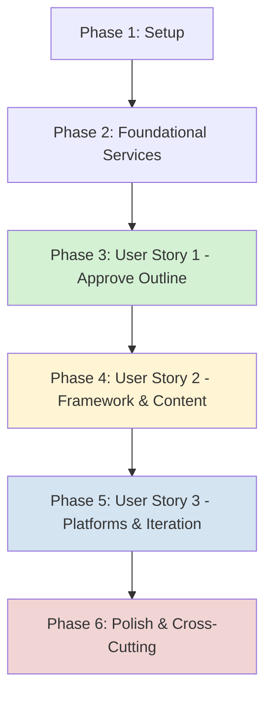

# Implementation Tasks: Personal AI Content Studio MVP

**Feature**: Personal AI Content Studio  
**Phase**: 3 (Implementation)  
**Date**: 2026-02-08  
**Approach**: Incremental by user story (MVP-first, independently testable)

---

## Task Organization Strategy

Tasks are organized by user story to enable:
- **Independent implementation**: Each story phase can be coded and tested separately
- **MVPfirst delivery**: User Story 1 (P1) is a complete, usable increment  
- **Parallel opportunities**: Tasks marked [P] can run concurrently
- **Clear

 completion criteria**: Each phase has independent test scenarios

---

## Phase 1: Setup & Infrastructure

**Goal**: Initialize project structure, dependencies, and core services  
**Prerequisites**: None  
**Duration**: 2-3 hours

### Tasks

- [x] T001 Create project directory structure per plan-LOCAL-HYBRID.md (backend/, frontend/, services/, scripts/)
- [x] T002 Create Python virtual environment and configure requirements.txt with all dependencies
- [x] T003 Create .gitignore to exclude .env, *.db, .venv, __pycache__, .content-studio/
- [x] T004 Create .env.example config template with non-secret configuration
- [x] T005 [P] Create scripts/setup_db.py to initialize SQLite schema from data-model-LOCAL.md
- [x] T006 [P] Verify secrets_service.py and setup_secrets.py are working (already created, test locally)
- [x] T007 Create backend/models/ SQLAlchemy ORM classes for sessions, outlines, validation_reports, content_drafts, platform_versions, iteration_feedback tables
- [x] T008 Create backend/models/reference_data.py for frameworks, platforms, focus_areas, visual_types (pre-populate with seed data)
- [x] T009 Create backend/main.py FastAPI application entry point with startup event for session cleanup
- [x] T010 Create frontend/Home.py as Streamlit entry point with navigation

**Completion Criteria**:
- ✅ Project structure matches plan-LOCAL-HYBRID.md
- ✅ `pip install -r requirements.txt` installs all dependencies
- ✅ `python scripts/setup_db.py` creates SQLite database with all tables and seed data
- ✅ `python services/secrets_service.py` retrieves test secrets from keyring
- ✅ `uvicorn backend.main:app` starts without errors
- ✅ `streamlit run frontend/Home.py` starts without errors

---

## Phase 2: Foundational Services (Blocking Prerequisites)

**Goal**: Implement core services needed by all user stories  
**Prerequisites**: Phase 1 complete  
**Duration**: 4-6 hours

### Tasks

- [x] T011 Create services/llm_service.py with ModelRouter class supporting GPT-4, Claude 3.5, Llama 3.1, Mistral, Copilot
- [x] T012 [P] Implement model selection logic in llm_service.py based on task type (classification, reasoning, creative, structured)
- [x] T013 [P] Add temperature configuration (0.3 for factual, 0.7 for creative) in llm_service.py
- [x] T014 Create services/search_service.py for Bing Search API integration with credibility scoring
- [x] T015 Implement claim extraction logic in search_service.py using Claude 3.5 for JSON parsing
- [x] T016 Create services/framework_engine.py with 6 framework templates (TED, Hero's Journey, Problem-Solution, Listicle, Comparison, Tutorial)
- [x] T017 [P] Implement framework mapping logic in framework_engine.py to map outline sections to framework steps
- [x] T018 Create backend/api/schemas.py with Pydantic models for all API request/response objects
- [x] T019 Create backend/api/routes.py with FastAPI router skeleton (endpoints defined, base implementations)
- [x] T020 [P] Add error handling middleware to backend/main.py for consistent error responses

**Completion Criteria**:
- ✅ llm_service.py can call at least 2 LLM models (GPT-4 + Claude or GPT-4 + Llama)
- ✅ search_service.py can perform Bing API search and return credibility scores
- ✅ framework_engine.py contains all 6 framework templates
- ✅ FastAPI `/docs` endpoint shows all API schemas
- ✅ All services can be instantiated and tested independently

---

## Phase 3: User Story 1 (P1) - Approve a Validated Outline

**Goal**: User can submit topic, receive validated outline, and approve/restart  
**Story**: As a single user, I want to enter a topic or URL and receive a fact-checked outline with a clear rationale so I can approve or restart before any content is generated.  
**Prerequisites**: Phase 1-2 complete  
**Duration**: 12-15 hours

### Independent Test Criteria for US1:
1. Submit a topic name (e.g., "AI and Emotional Intelligence in Leadership")
2. System extracts theme, audience, intent
3. System generates outline with content angle and sections
4. System validates outline via web search (70% confidence minimum)
5. System presents outline with sources and compelling reason
6. User can approve, modify, or restart
7. If confidence < 70%, system blocks and requires outline regeneration

### Tasks

#### Input Agent (Topic Intake)
- [ ] T021 [US1] Create backend/agents/input_agent.py with topic extraction logic using Llama 3.1
- [ ] T022 [US1] Implement focus area matching in input_agent.py against reference data (AI, Cloud, Migration, EmotionalIntelligence, EmergingTech)
- [ ] T023 [US1] Add out-of-scope warning logic in input_agent.py (warn if OUT_OF_SCOPE, allow user override)
- [ ] T024 [US1] Create Session ORM instance and save to sessions table with status='input'

#### Reasoning Agent (Outline Generation)
- [ ] T025 [US1] Create backend/agents/reasoning_agent.py with outline generation using GPT-4 Turbo
- [ ] T026 [US1] Implement content angle reasoning in reasoning_agent.py (why this angle matters)
- [ ] T027 [US1] Generate outline sections with target audience and primary intent in reasoning_agent.py
- [ ] T028 [US1] Create Outline ORM instance and save to outlines table with version=1, user_approved=0

#### Research Agent (Validation)
- [ ] T029 [US1] Create backend/agents/research_agent.py with claim extraction using Claude 3.5
- [ ] T030 [US1] Implement web search integration in research_agent.py (call search_service for each claim)
- [ ] T031 [US1] Calculate confidence score in research_agent.py (credible_sources_found / claims_checked)
- [ ] T032 [US1] Create ValidationReport ORM instance with passed_validation = (confidence >= 0.7)
- [ ] T033 [US1] Block progression if validation fails in research_agent.py (return error to frontend)

#### LangGraph Orchestration
- [ ] T034 [US1] Create backend/orchestration/state_graph.py with LangGraph StateGraph for US1 flow
- [ ] T035 [US1] Define SessionState TypedDict in state_graph.py (session_id, topic, outline, validation_report)
- [ ] T036 [US1] Add nodes for input → reasoning → research in state_graph.py
- [ ] T037 [US1] Add conditional edge in state_graph.py: if validation passes → outline_review, else → reasoning
- [ ] T038 [US1] Implement state persistence to SQLite after each agent completes

#### API Endpoints (Backend)
- [ ] T039 [US1] Implement POST /api/sessions endpoint in backend/api/routes.py (create session, run input agent)
- [ ] T040 [US1] Implement POST /api/sessions/{id}/outline endpoint (run reasoning + research agents)
- [ ] T041 [US1] Implement GET /api/sessions/{id}/outline endpoint (retrieve outline with validation report)
- [ ] T042 [US1] Implement POST /api/sessions/{id}/approve endpoint (mark outline as approved, update status)
- [ ] T043 [US1] Implement POST /api/sessions/{id}/restart endpoint (increment outline version, re-run reasoning agent)

#### Frontend UI (Streamlit)
- [ ] T044 [US1] Create frontend/pages/1_New_Session.py with topic input form (text input for topic name/description)
- [ ] T045 [US1] Add URL input option in 1_New_Session.py (optional field)
- [ ] T046 [US1] Display focus area match result and out-of-scope warning in 1_New_Session.py
- [ ] T047 [US1] Create frontend/components/outline_review.py component to display outline, sections, content angle
- [ ] T048 [US1] Display validation report in outline_review.py (confidence score, sources, issues)
- [ ] T049 [US1] Add approval buttons in outline_review.py (Approve, Modify, Restart)
- [ ] T050 [US1] Handle validation failure in outline_review.py (show error, disable Approve button)
- [ ] T051 [US1] Implement restart logic in 1_New_Session.py (increment version, re-generate outline)

#### Testing
- [ ] T052 [US1] Write unit test for input_agent.py (test topic extraction, focus area matching)
- [ ] T053 [US1] Write unit test for reasoning_agent.py (test outline generation)
- [ ] T054 [US1] Write unit test for research_agent.py (mock Bing API, test confidence calculation)
- [ ] T055 [US1] Write integration test for US1 end-to-end flow (topic → outline → validation → approval)
- [ ] T056 [US1] Test with real topic: "AI and Emotional Intelligence in Leadership" (validate 70%+ confidence)

**Completion Criteria for User Story 1**:
- ✅ User can submit a topic via Streamlit UI
- ✅ System generates outline with content angle
- ✅ System validates outline with web search (confidence score displayed)
- ✅ If confidence >= 70%, user can approve
- ✅ If confidence < 70%, system blocks and allows restart
- ✅ Outline with sources and rationale is presented to user
- ✅ User can approve, modify, or restart
- ✅ All data persisted to SQLite (sessions, outlines, validation_reports tables)
- ✅ End-to-end test passes with real topic

---

## Phase 4: User Story 2 (P2) - Generate Content with Framework and Visuals

**Goal**: User picks framework and visual strategy, system generates structured draft with visuals  
**Story**: As a single user, I want to pick a storytelling framework and a visual strategy so the final content is compelling, concise, and easy to grasp.  
**Prerequisites**: US1 complete (approved outline exists)  
**Duration**: 10-12 hours

### Independent Test Criteria for US2:
1. Start with an approved outline from US1
2. System recommends storytelling framework based on topic
3. User can select framework (TED, Hero's Journey, etc.) or accept recommendation
4. System generates 2-4 visual recommendations
5. User can opt-in/opt-out of visuals
6. System generates final content draft following framework with visuals embedded
7. If code requested, system includes code snippets with explanations

### Tasks

#### Storytelling & Visual Agent
- [x] T057 [US2] Create backend/agents/storytelling_agent.py with framework recommendation logic using GPT-4
- [x] T058 [US2] Implement framework mapping in storytelling_agent.py (map outline sections to framework steps)
- [x] T059 [US2] Generate visual plan in storytelling_agent.py (2-4 visuals: type, location, description, rationale)
- [x] T060 [US2] Support visual opt-out in storytelling_agent.py (user can skip visuals, but system defaults to >=1)
- [x] T061 [US2] Save framework_choice and visual_plan to session state in storytelling_agent.py

#### Content Agent (Narrative Synthesis)
- [x] T062 [US2] Create backend/agents/content_agent.py with content generation using GPT-4 Turbo
- [x] T063 [US2] Implement framework-guided narrative structure in content_agent.py (follow framework steps)
- [x] T064 [US2] Weave visual references into content in content_agent.py (e.g., "[See Visual 1: Flow diagram]")
- [x] T065 [US2] Generate code snippets if requested in content_agent.py (using GitHub Copilot or GPT-4)
- [x] T066 [US2] Create ContentDraft ORM instance with body_text, visual_plan, framework_choice, code_snippets
- [x] T067 [US2] Generate Mermaid diagram code for visuals in content_agent.py (flowchart, sequence, architecture, etc.)

#### LangGraph Orchestration (Extend)
- [x] T068 [US2] Add nodes to state_graph.py for storytelling_agent and content_agent
- [x] T069 [US2] Add conditional edge: after outline approval → framework_selection
- [x] T070 [US2] Update SessionState to include framework_choice, visual_plan, content_draft

#### API Endpoints
- [x] T071 [US2] Implement GET /api/frameworks endpoint to return available frameworks with descriptions
- [x] T072 [US2] Implement POST /api/sessions/{id}/framework endpoint (select framework, run storytelling agent)
- [x] T073 [US2] Implement POST /api/sessions/{id}/content endpoint (run content agent, generate draft)
- [x] T074 [US2] Implement GET /api/sessions/{id}/content endpoint (retrieve content draft with visuals)

#### Frontend UI
- [x] T075 [US2] Create frontend/components/framework_selector.py with framework selection UI (radio buttons)
- [x] T076 [US2] Display framework recommendation in framework_selector.py (system suggests, user can override)
- [x] T077 [US2] Add visual preference toggles in framework_selector.py (opt-in/opt-out per visual type)
- [x] T078 [US2] Create frontend/components/content_preview.py to display generated content draft
- [x] T079 [US2] Render Mermaid diagrams in content_preview.py using streamlit-mermaid
- [x] T080 [US2] Display code snippets with syntax highlighting in content_preview.py

#### Testing
- [ ] T081 [US2] Write unit test for storytelling_agent.py (test framework mapping and visual plan generation)
- [ ] T082 [US2] Write unit test for content_agent.py (test narrative generation with framework structure)
- [ ] T083 [US2] Write integration test for US2 (outline → framework → content draft)
- [ ] T084 [US2] Test Mermaid rendering in Streamlit (verify flowchart, sequence diagrams work)
- [ ] T085 [US2] Test with real scenario: Select Hero's Journey framework, generate content with 3 visuals

**Completion Criteria for User Story 2**:
- ✅ System recommends framework based on approved outline
- ✅ User can select framework via Streamlit UI
- ✅ User can opt-in/opt-out of visuals
- ✅ System generates content draft following selected framework
- ✅ System embeds visual references in content
- ✅ Mermaid diagrams render correctly in Streamlit
- ✅ Code snippets included if requested (with explanation and expected output)
- ✅ ContentDraft persisted to content_drafts table
- ✅ End-to-end test passes from outline approval → content generation

---

## Phase 5: User Story 3 (P3) - Platform Adaptation and Iteration

**Goal**: Generate platform-specific versions and iterate until user says "ok and good"  
**Story**: As a single user, I want platform-specific versions and an improvement loop so I can refine the content until I say "ok and good".  
**Prerequisites**: US2 complete (content draft exists)  
**Duration**: 8-10 hours

### Independent Test Criteria for US3:
1. Start with a content draft from US2
2. System generates platform-specific versions for all 6 platforms (LinkedIn, Twitter, Reddit, Medium, Substack, Instagram)
3. User can request improvements for specific platforms or all
4. System collects feedback (tone, depth, visuals, technicality, humor, examples, structure)
5. User can iterate multiple times
6. Session ends when user says "ok and good"
7. Iteration count tracked and displayed

### Tasks

#### Platform Agent
- [x] T086 [US3] Create backend/agents/platform_agent.py with platform adaptation logic using Llama 3.1 (cost-effective)
- [x] T087 [US3] Load platform templates from reference data in platform_agent.py (tone, format, min/max length, visual requirements)
- [x] T088 [US3] Generate LinkedIn version in platform_agent.py (professional, bullet points, hashtags, 500-3000 chars)
- [x] T089 [US3] Generate Twitter/X thread in platform_agent.py (conversational, max 280 chars/tweet, 10-thread max)
- [x] T090 [US3] Generate Reddit post in platform_agent.py (authentic, markdown, long-form OK, 300-40000 chars)
- [x] T091 [US3] Generate Medium article in platform_agent.py (narrative, blog-style, section headers, 1000-10000 chars)
- [x] T092 [US3] Generate Substack newsletter in platform_agent.py (conversational, intimate, 800-8000 chars)
- [x] T093 [US3] Generate Instagram caption in platform_agent.py (visual-first, concise, 100-2200 chars, emojis)
- [x] T094 [US3] Create PlatformVersion ORM instances for each platform (6 total) with content, version=1
- [x] T095 [US3] Implement iteration logic in platform_agent.py (regenerate based on feedback areas)

#### Iteration & Feedback
- [x] T096 [US3] Create backend/agents/iteration_handler.py to process user feedback
- [x] T097 [US3] Implement feedback area categorization in iteration_handler.py (tone, depth, visuals, technicality, humor, examples, structure)
- [x] T098 [US3] Determine affected components in iteration_handler.py (content draft, platform versions, visuals)
- [x] T099 [US3] Regenerate content based on feedback in iteration_handler.py (call content_agent or platform_agent)
- [x] T100 [US3] Create IterationFeedback ORM instance with iteration_number, feedback_areas, regenerated_content
- [x] T101 [US3] Detect "ok and good" phrase in iteration_handler.py (mark session as completed)

#### LangGraph Orchestration (Complete)
- [x] T102 [US3] Add nodes to state_graph.py for platform_agent and iteration_handler
- [x] T103 [US3] Add conditional edge: after content draft → platform_review
- [x] T104 [US3] Add loop edge: platform_review → (if feedback) → iteration → platform_review, else → completed
- [x] T105 [US3] Update SessionState to include platform_versions, iteration_feedback, iteration_count

#### API Endpoints
- [x] T106 [US3] Implement POST /api/sessions/{id}/platforms endpoint (generate all platform versions)
- [x] T107 [US3] Implement GET /api/sessions/{id}/platforms endpoint (retrieve all platform versions)
- [x] T108 [US3] Implement POST /api/sessions/{id}/iterate endpoint (submit feedback, regenerate)
- [x] T109 [US3] Implement POST /api/sessions/{id}/complete endpoint (mark session as "ok and good")

#### Frontend UI
- [x] T110 [US3] Create frontend/components/platform_versions.py to display all 6 platform outputs
- [x] T111 [US3] Add platform-specific preview formatting in platform_versions.py (LinkedIn bullets, Twitter thread, etc.)
- [x] T112 [US3] Create frontend/components/iteration_loop.py with feedback form (checkboxes for improvement areas + freeform text)
- [x] T113 [US3] Display iteration count in iteration_loop.py (e.g., "Refinement cycle 2 of 3")
- [x] T114 [US3] Add "ok and good" button in iteration_loop.py to complete session
- [x] T115 [US3] Show regenerated content after iteration in platform_versions.py (highlight changed sections)

#### Testing
- [x] T116 [US3] Write unit test for platform_agent.py (test LinkedIn and Twitter generation)
- [x] T117 [US3] Write unit test for iteration_handler.py (test feedback processing and component selection)
- [x] T118 [US3] Write integration test for US3 (content draft → platforms → iteration → "ok and good")
- [x] T119 [US3] Test iteration limit (verify system handles 5+ iterations gracefully)
- [x] T120 [US3] Test "ok and good" phrase detection (case-insensitive, partial match)

**Completion Criteria for User Story 3**:
- ✅ System generates 6 platform-specific versions from content draft
- ✅ User can view all platform versions via Streamlit UI
- ✅ User can submit feedback (selected areas + freeform text)
- ✅ System regenerates content based on feedback
- ✅ Iteration count tracked and displayed
- ✅ Session ends when user says "ok and good"
- ✅ PlatformVersion and IterationFeedback persisted to SQLite
- ✅ End-to-end test passes with at least 2 iteration cycles

---

## Phase 6: Polish & Cross-Cutting Concerns

**Goal**: Session history, settings, error handling, and final UX polish  
**Prerequisites**: US1-3 complete  
**Duration**: 6-8 hours

### Tasks

#### Session History
- [x] T121 Create frontend/pages/2_History.py to display all sessions (max 10, sorted by created_at DESC)
- [x] T122 Add session summary cards in 2_History.py (topic, status, iteration count, created date)
- [x] T123 [P] Implement session detail view in 2_History.py (show outline, content draft, platform versions)
- [x] T124 [P] Add resume session feature in 2_History.py (load incomplete session, continue from last state)

#### Settings & Configuration
- [x] T125 Create frontend/pages/3_Settings.py with model selection UI (choose default LLM model)
- [x] T126 [P] Add platform preferences in 3_Settings.py (enable/disable specific platforms)
- [x] T127 [P] Add visual preferences in 3_Settings.py (default visual types, opt-in/opt-out default)
- [x] T128 [P] Add session limit configuration in 3_Settings.py (max sessions, auto-cleanup toggle)

#### Error Handling & Logging
- [x] T129 Add comprehensive error handling to all agents (try/except with logging)
- [x] T130 Create backend/utils/logger.py with Python logging configuration (console + file output)
- [x] T131 [P] Add request/response logging to FastAPI middleware
- [x] T132 [P] Add user-friendly error messages in Streamlit (avoid technical stack traces)

#### Session Cleanup & Maintenance
- [x] T133 Implement auto-cleanup logic in backend/main.py startup event (delete sessions beyond max 10)
- [x] T134 [P] Add manual cleanup button in 3_Settings.py (delete old sessions on demand)
- [x] T135 [P] Create backup/export feature in 2_History.py (export session as JSON)

#### Final UI Polish
- [x] T136 Add loading spinners to Streamlit UI (during agent execution)
- [x] T137 [P] Add progress indicators in 1_New_Session.py (show current step: input → outline → framework → content → platforms)
- [x] T138 [P] Improve session state management in Streamlit (ensure state persists across reruns)
- [x] T139 [P] Add tooltips and help text to all UI components

#### Documentation
- [x] T140 Create README.md with quick start guide (setup, run, first session)
- [x] T141 [P] Create CONTRIBUTING.md with development workflow (test, lint, commit)
- [x] T142 [P] Update quickstart-LOCAL.md with end-to-end walkthrough using real scenario

**Completion Criteria for Phase 6**:
- ✅ User can view all session history (max 10)
- ✅ User can resume incomplete sessions
- ✅ User can configure model and platform preferences
- ✅ Auto-cleanup removes sessions beyond max 10 on startup
- ✅ Error messages are user-friendly (no stack traces in UI)
- ✅ All agents log to `~/.content-studio/app.log`
- ✅ README.md provides clear setup and usage instructions
- ✅ UI has loading indicators and progress tracking

---

## Dependency Graph (User Story Completion Order)

### Critical Path:
1. **Setup** (T001-T010) → Must complete first
2. **Foundational** (T011-T020) → Blocks all user stories
3. **US1** (T021-T056) → Blocks US2 and US3 (approved outline required)
4. **US2** (T057-T085) → Blocks US3 (content draft required)
5. **US3** (T086-T120) → Final user story
6. **Polish** (T121-T142) → Can start after US3 core is working

---

## Parallel Execution Opportunities

### Within Phase 1 (Setup):
- T005 (setup_db.py) can run in parallel with T006 (verify secrets)
- T007 (ORM models) can run in parallel with T010 (Streamlit entry point)

### Within Phase 2 (Foundational):
- T012, T013 (model selection) can run in parallel
- T015 (claim extraction) can run in parallel with T017 (framework mapping)
- T020 (error middleware) can run in parallel with T019 (route skeleton)

### Within US1:
- T022 (focus area matching) can run in parallel with T023 (out-of-scope warning)
- T026 (content angle) can run in parallel with T027 (outline sections)
- T044-T046 (Streamlit forms) can run in parallel with T039-T043 (API endpoints)
- T052-T054 (unit tests) can run in parallel after agent implementations

### Within US2:
- T058 (framework mapping) can run in parallel with T059 (visual plan)
- T075-T077 (framework selector UI) can run in parallel with T071-T074 (API endpoints)
- T081-T082 (unit tests) can run in parallel

### Within US3:
- T088-T093 (platform-specific logic) can be implemented in parallel (different developers or concurrent coding)
- T110-T112 (platform display) can run in parallel with T106-T109 (API endpoints)
- T116-T117 (unit tests) can run in parallel

### Within Phase 6 (Polish):
- T123 (session detail) can run in parallel with T121 (history view)
- T126, T127, T128 (settings) can run in parallel
- T131 (logging) can run in parallel with T132 (error messages)
- T140, T141, T142 (documentation) can run in parallel

---

## Parallel Execution Examples (Per User Story)

### US1: Outline Approval
**Sequential**: T021 → T025 → T029 → T034 → T039 → T044 → T052  
**Parallel Batches**:
- Batch 1: T021, T025, T029 (agents can be coded simultaneously)
- Batch 2: T034 (orchestration after agents)
- Batch 3: T039-T043 (API endpoints in parallel)
- Batch 4: T044-T051 (UI components in parallel)
- Batch 5: T052-T054 (tests in parallel)
- Batch 6: T055-T056 (integration test)

**Time Savings**: 12-15 hours → 8-10 hours with parallelization

### US2: Framework & Content
**Sequential**: T057 → T062 → T068 → T071 → T075 → T081  
**Parallel Batches**:
- Batch 1: T057, T062 (agents simultaneously)
- Batch 2: T068-T070 (orchestration)
- Batch 3: T071-T074, T075-T080 (API + UI in parallel)
- Batch 4: T081-T084 (tests in parallel)

**Time Savings**: 10-12 hours → 7-9 hours

### US3: Platforms & Iteration
**Sequential**: T086 → T096 → T102 → T106 → T110 → T116  
**Parallel Batches**:
- Batch 1: T086-T095 (platform logic, can split by platform)
- Batch 2: T096-T101 (iteration handler)
- Batch 3: T102-T105 (orchestration)
- Batch 4: T106-T109, T110-T115 (API + UI in parallel)
- Batch 5: T116-T120 (tests in parallel)

**Time Savings**: 8-10 hours → 6-7 hours

---

## Implementation Strategy & MVP Definition

### MVP Scope (Deploy After Phase 3)
After completing **User Story 1**, you have a working MVP:
- ✅ User can submit topic
- ✅ System generates validated outline
- ✅ User can approve or restart
- ✅ 70% validation enforced
- ✅ Data persisted to SQLite

**Recommendation**: Deploy US1 to personal use, test with real topics, then proceed to US2.

### Incremental Delivery Timeline

| Phase | Duration | Cumulative | Deliverable |
|-------|----------|-----------|-------------|
| Phase 1: Setup | 2-3 hours | 3 hours | Project structure ready |
| Phase 2: Foundation | 4-6 hours | 9 hours | Core services working |
| Phase 3: US1 | 12-15 hours | 24 hours | **MVP 1: Outline approval** ✨ |
| Phase 4: US2 | 10-12 hours | 36 hours | **MVP 2: Content generation** ✨ |
| Phase 5: US3 | 8-10 hours | 46 hours | **MVP 3: Full workflow** ✨ |
| Phase 6: Polish | 6-8 hours | 54 hours | Production-ready |

**Total Estimated Effort**: 50-60 hours (2-3 weeks solo, 40 hours/week)

---

## Task Checklist Format Legend

- **[TaskID]**: Sequential task number (T001, T002, etc.)
- **[P]**: Parallelizable task (can run concurrently with others in same batch)
- **[US1]/[US2]/[US3]**: User story label (required for story-specific tasks)
- **Description**: Clear action with specific file path
- **Checkbox**: `- [ ]` for not started, `- [x]` for complete

---

## Quality Gates (Per Phase)

### Phase 1 Gate:
- [ ] All project directories created
- [ ] Virtual environment with dependencies installed
- [ ] SQLite database schema created
- [ ] FastAPI and Streamlit servers start without errors

### Phase 2 Gate:
- [ ] LLM service can call 2+ models
- [ ] Search service can query Bing API
- [ ] Framework engine has all 6 templates
- [ ] API schemas defined in Pydantic

### Phase 3 Gate (US1):
- [ ] End-to-end test passes: topic → outline → validation → approval
- [ ] Validation blocks progression if confidence < 70%
- [ ] Data persists correctly to SQLite

### Phase 4 Gate (US2):
- [ ] Framework selection works in UI
- [ ] Content draft generated with framework structure
- [ ] Mermaid diagrams render in Streamlit

### Phase 5 Gate (US3):
- [ ] All 6 platforms generate correctly
- [ ] Iteration loop works (feedback → regenerate → review)
- [ ] "ok and good" phrase completes session

### Phase 6 Gate:
- [ ] Session history displays correctly
- [ ] Settings allow model/platform configuration
- [ ] Auto-cleanup removes old sessions
- [ ] README provides clear setup instructions

---

## Success Metrics (From spec.md)

After implementation completes, verify:

- **SC-001**: 90% of sessions reach approved outline within 2 iterations
  - Track: `SELECT AVG(version) FROM outlines WHERE user_approved=1`
  
- **SC-002**: 95% of sessions have ≥2 sources in validation
  - Track: `SELECT AVG(credible_sources_found) FROM validation_reports`
  
- **SC-003**: Full cycle completes in <20 minutes
  - Track: End timestamps (session creation → completion)
  
- **SC-004**: 90% of sessions end in ≤3 refinement cycles
  - Track: `SELECT AVG(iteration_count) FROM sessions WHERE status='completed'`
  
- **SC-005**: 100% respect focus areas, no secrets in repo
  - Manual audit: Check .gitignore, verify keyring usage

---

## Final Checklist

Before marking implementation complete:

- [ ] All 142 tasks completed
- [ ] All 6 quality gates passed
- [ ] End-to-end test with real topic passes all 3 user stories
- [ ] README.md provides accurate setup instructions
- [ ] No secrets in git repository (verify .gitignore working)
- [ ] SQLite database auto-cleanup works (max 10 sessions)
- [ ] All 5 success criteria measurable and documented
- [ ] First real content session created successfully

---

**Next Action**: Begin Phase 1 (T001-T010) to set up project structure and dependencies.

**Estimated Timeline**: 2-3 weeks to full MVP (all 3 user stories + polish)

**MVP Milestone**: After Phase 3 (US1 complete), you can start using the outline approval workflow personally!
